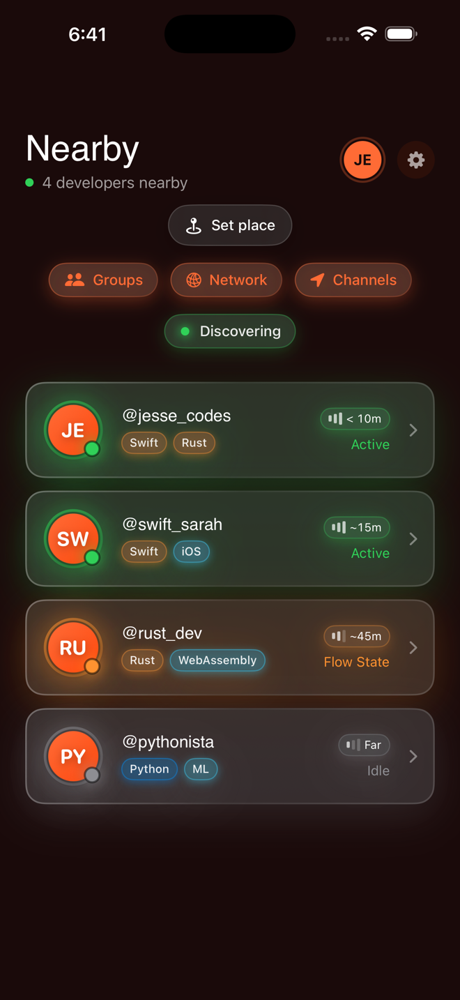
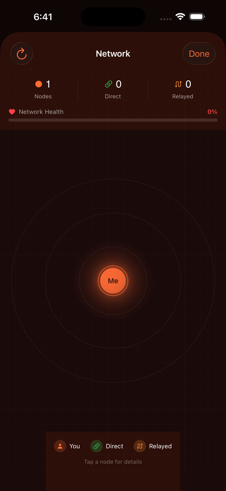
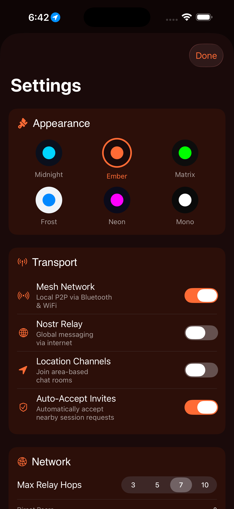
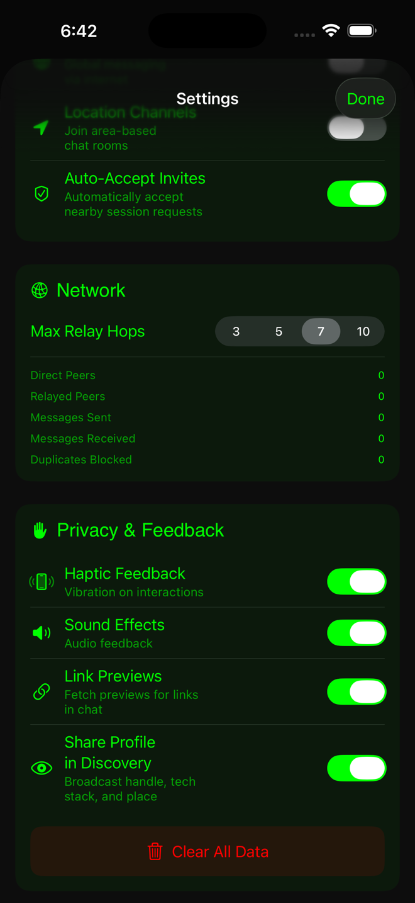

# Pulse ZERO v1

**Decentralized messaging for iOS.**

A high-performance iOS messaging engine written 100% in **Swift**. Pulse facilitates peer-to-peer, decentralized communication without reliance on centralized servers. Built for the 2026 iOS ecosystem with secure key management, mesh networking, and real-time data streaming via Nostr relays.

> No servers. No silos. Just Pulse.

---

## The Vision

Pulse ZERO is inspired by **Bitchat** and the broader **Nostr** ecosystem—protocols championed by Jack Dorsey and the open-source community. The goal is to move away from "platforms" and toward "protocols," ensuring that your identity and your conversations remain yours, regardless of who owns the network.

This isn't just an app; it's a step toward sovereign communication—private, censorship-resistant, and entirely user-owned.

---

## Features

### Core Messaging
| Category | What Pulse Does |
|----------|-----------------|
| **Mesh Discovery** | Nearby peer detection via Bluetooth LE and MultipeerConnectivity |
| **End-to-End Encryption** | All messages encrypted with Curve25519 key exchange |
| **Message Signing** | Ed25519 signatures verify sender authenticity |
| **Resilient Delivery** | Acknowledgements, deduplication, and multi-hop routing |
| **Privacy Controls** | Toggles for link previews, discovery profile sharing, and data retention |
| **Offline-First** | Local SwiftData persistence; works without internet |

### Nostr Protocol
| Category | What Pulse Does |
|----------|-----------------|
| **Relay Connections** | Connect to multiple Nostr relays for global reach |
| **Event Signing** | secp256k1 Schnorr signatures for Nostr events |
| **Location Channels** | Geohash-based public channels for local discovery |
| **Profile Metadata** | NIP-01 profile publishing |
| **NIP-42 Auth** | Relay authentication challenge/response |

### Security Hardening
| Category | What Pulse Does |
|----------|-----------------|
| **Signature Validation** | All Nostr events cryptographically verified |
| **Rate Limiting** | DoS protection for relay events |
| **Certificate Pinning** | TLS validation for all network connections |
| **Clipboard Protection** | Auto-clear sensitive data after 30 seconds |
| **Privacy UI** | `.privacySensitive()` modifiers hide data in app switcher |
| **Secure Keychain** | Keys stored with `WhenUnlockedThisDeviceOnly` access control |

---

## Screenshots

<p>
  
  
  
  
  
</p>

## Walkthrough

[Watch the walkthrough video](media/walkthrough.mp4)

---

## Architecture

```
+----------------------------------------------------------------+
|                        SwiftUI Views                           |
|   ChatView | ProfileView | SettingsView | RadarView            |
+----------------------------------------------------------------+
|  ChatManager  |  MeshManager  |  IdentityManager               |
+----------------------------------------------------------------+
|              UnifiedTransportManager (Mesh + Nostr)             |
+----------------------------------------------------------------+
|  MultipeerConnectivity  |  BLE Advertiser  |  NostrTransport    |
+----------------------------------------------------------------+
|  SecureNetworkSession  |  NostrEventValidator  |  RateLimiter   |
+----------------------------------------------------------------+
```

### Key Components

- **Managers/** — Business logic (chat, mesh, identity, persistence)
- **Networking/** — Transport protocols, Nostr relay connections
- **Models/** — Data types (Message, PulsePeer, NostrIdentity)
- **Views/** — SwiftUI interface with Liquid Glass design
- **Utilities/** — Clipboard security, debug logging, avatar management

### Security Components

| Component | Purpose |
|-----------|---------|
| `NostrEventValidator` | Validates event signatures and format |
| `SecureNetworkSession` | TLS certificate validation |
| `ClipboardManager` | Auto-clears sensitive clipboard data |
| `RateLimiter` | Prevents event flooding |

---

## Getting Started

1. Clone the repo
2. Open `Pulse/Pulse.xcodeproj` in Xcode 26+
3. Select an iOS 26 simulator or device
4. Run the `Pulse` scheme

```bash
git clone https://github.com/joeynyc/Pulse-ZERO-v1.git
cd Pulse-ZERO-v1/Pulse
open Pulse.xcodeproj
```

---

## Tests

```bash
xcodebuild -project Pulse.xcodeproj -scheme PulseTests \
  -sdk iphonesimulator \
  -destination 'platform=iOS Simulator,OS=26.2,name=iPhone 17' \
  test
```

### Test Suite

| Test File | Coverage |
|-----------|----------|
| `PulseIdentityTests` | Identity creation, encryption, signing |
| `NostrNormalizationTests` | Deterministic JSON for Nostr events |
| `NostrEventValidatorTests` | Event signature validation |
| `SecurityHardeningTests` | Rate limiting |
| `ProductionSecurityTests` | End-to-end security scenarios |
| `ErrorManagerTests` | Sensitive string scrubbing |
| `RateLimiterTests` | Rate limiter window and reset logic |
| `MeshSimulatorTests` | Virtual peer network testing |

---

## Documentation

| Doc | Description |
|-----|-------------|
| [PULSE_iOS26_ARCHITECTURE.md](PULSE_iOS26_ARCHITECTURE.md) | Technical deep-dive into the system design |
| [PULSE_AUDIT_REPORT.md](PULSE_AUDIT_REPORT.md) | Security audit findings and remediations |
| [IMPROVEMENTS_SUMMARY.md](IMPROVEMENTS_SUMMARY.md) | Changelog of major improvements |
| [QUICK_START.md](QUICK_START.md) | Fast-track setup guide |
| [PRIVACY_POLICY.md](Pulse/PRIVACY_POLICY.md) | Privacy policy |

---

## Security Model

### Threat Mitigations

| Threat | Mitigation |
|--------|------------|
| Relay Event Flooding | Fixed-window rate limiter (60 events/sec) |
| MITM Attacks | Certificate validation on all HTTPS/WSS connections |
| Clipboard Sniffing | Auto-clear after 30s + clear on background |
| Key Extraction | Keychain with biometric/device-only access |

### Cryptographic Primitives

- **Encryption**: Curve25519 (X25519) key exchange + ChaCha20-Poly1305
- **Signing**: Ed25519 for mesh messages, secp256k1 Schnorr for Nostr
- **Hashing**: SHA-256 for event IDs
- **Key Storage**: iOS Keychain with `.whenUnlockedThisDeviceOnly`

---

## Inspiration & Credits

Pulse ZERO draws heavily from:
- **[Nostr](https://nostr.com/)** — The decentralized social protocol
- **Bitchat** — Jack Dorsey's vision for open, censorship-resistant messaging
- **[secp256k1](https://github.com/bitcoin-core/secp256k1)** — Elliptic curve cryptography

This project exists because open protocols matter.

---

## License

MIT License. See [LICENSE](LICENSE) for details.

---

<p align="center">
  <strong>Built with love by <a href="https://github.com/JesseRod329">Jesse Rodriguez</a></strong>
</p>
