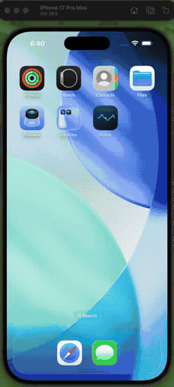

# Pulse ZERO v1

**Decentralized messaging for iOS.**

   

A high-performance iOS messaging engine written 100% in **Swift**. Pulse ZERO facilitates peer-to-peer, decentralized communication without reliance on centralized servers. Built for the 2026 iOS ecosystem with secure key management, mesh networking, and real-time data streaming via Nostr relays.

> No servers. No silos. Just Pulse.

---

## The Vision

Pulse ZERO is inspired by **Bitchat** and the broader **Nostr** ecosystem—protocols championed by Jack Dorsey and the open-source community. The goal is to move away from "platforms" and toward "protocols," ensuring that your identity and your conversations remain yours, regardless of who owns the network.

This isn't just an app; it's a step toward sovereign communication—private, censorship-resistant, and entirely user-owned.

---

## How It Works

Pulse ZERO uses a **dual-transport system** to deliver messages. When peers are nearby, messages travel directly over **Bluetooth LE and MultipeerConnectivity** — no internet required. For global reach, messages route through **Nostr relays** over WebSocket connections. Both paths are end-to-end encrypted and signature-verified, so your messages stay private regardless of which transport carries them. A unified routing layer handles deduplication, acknowledgements, and multi-hop forwarding automatically.

---

## Features

### Core Messaging
| Category | What Pulse Does |
|----------|-----------------|
| **Mesh Discovery** | Nearby peer detection via Bluetooth LE and MultipeerConnectivity |
| **End-to-End Encryption** | All messages encrypted with Curve25519 key exchange |
| **Message Signing** | Ed25519 signatures verify sender authenticity |
| **Resilient Delivery** | Acknowledgements, deduplication, and multi-hop routing |
| **Privacy Controls** | Toggles for link previews, discovery profile sharing, and data retention |
| **Offline-First** | Local SwiftData persistence; works without internet |

### Nostr Protocol
| Category | What Pulse Does |
|----------|-----------------|
| **Relay Connections** | Connect to multiple Nostr relays for global reach |
| **Event Signing** | secp256k1 Schnorr signatures for Nostr events |
| **Location Channels** | Geohash-based public channels for local discovery |
| **Profile Metadata** | NIP-01 profile publishing |
| **NIP-42 Auth** | Relay authentication challenge/response |

### Security Hardening
| Category | What Pulse Does |
|----------|-----------------|
| **Signature Validation** | All Nostr events cryptographically verified |
| **Rate Limiting** | DoS protection for relay events |
| **Certificate Pinning** | TLS validation for all network connections |
| **Clipboard Protection** | Auto-clear sensitive data after 30 seconds |
| **Privacy UI** | `.privacySensitive()` modifiers hide data in app switcher |
| **Secure Keychain** | Keys stored with `WhenUnlockedThisDeviceOnly` access control |

---

## Screenshots

<p>
  
  
  
  
  
</p>

## Walkthrough



[Watch the full video](media/walkthrough.mp4)

---

## Architecture

```
+----------------------------------------------------------------+
|                        SwiftUI Views                           |
|   ChatView | ProfileView | SettingsView | RadarView            |
+----------------------------------------------------------------+
|  ChatManager  |  MeshManager  |  IdentityManager               |
+----------------------------------------------------------------+
|              UnifiedTransportManager (Mesh + Nostr)             |
+----------------------------------------------------------------+
|  MultipeerConnectivity  |  BLE Advertiser  |  NostrTransport    |
+----------------------------------------------------------------+
|  SecureNetworkSession  |  NostrEventValidator  |  RateLimiter   |
+----------------------------------------------------------------+
```

### Key Components

- **Managers/** — Business logic (chat, mesh, identity, persistence)
- **Networking/** — Transport protocols, Nostr relay connections
- **Models/** — Data types (Message, PulsePeer, NostrIdentity)
- **Views/** — SwiftUI interface with Liquid Glass design
- **Utilities/** — Clipboard security, debug logging, avatar management

---

## Requirements

- Xcode 26+
- iOS 26.0+
- Swift 5.0

## Getting Started

1. Clone the repo
2. Open `Pulse/Pulse.xcodeproj` in Xcode
3. Select an iOS 26 simulator or device
4. Run the `Pulse` scheme

```bash
git clone https://github.com/joeynyc/Pulse-ZERO-v1.git
cd Pulse-ZERO-v1/Pulse
open Pulse.xcodeproj
```

---

## Tests

```bash
xcodebuild -project Pulse.xcodeproj -scheme PulseTests \
  -sdk iphonesimulator \
  -destination 'platform=iOS Simulator,OS=26.2,name=iPhone 17' \
  test
```

---

## Security Model

| Threat | Mitigation |
|--------|------------|
| Relay Event Flooding | Fixed-window rate limiter (60 events/sec) |
| MITM Attacks | Certificate validation on all HTTPS/WSS connections |
| Clipboard Sniffing | Auto-clear after 30s + clear on background |
| Key Extraction | Keychain with biometric/device-only access |

---

## Inspiration & Credits

Pulse ZERO draws heavily from:
- **[Nostr](https://nostr.com/)** — The decentralized social protocol
- **Bitchat** — Jack Dorsey's vision for open, censorship-resistant messaging
- **[secp256k1](https://github.com/bitcoin-core/secp256k1)** — Elliptic curve cryptography

This project exists because open protocols matter.

---

## Contributing

PRs welcome. Please open an issue first to discuss what you'd like to change.

---

## Disclaimer

Pulse ZERO is provided **for educational and lawful use only**. This software is designed for private, peer-to-peer communication over open protocols. Users are solely responsible for ensuring their use of this software complies with all applicable local, state, federal, and international laws. The authors do not condone and are not responsible for any illegal use of this software, including but not limited to unauthorized surveillance, harassment, or distribution of prohibited content.

**This software is provided "as is" without warranty of any kind.** See the [LICENSE](LICENSE) for full terms.

## AI & API Compliance

Development of Pulse ZERO uses AI-assisted tooling (Claude Code by Anthropic). All AI usage complies with [Anthropic's Acceptable Use Policy](https://www.anthropic.com/policies/aup) and [Terms of Service](https://www.anthropic.com/policies/terms). No AI models are embedded in or distributed with this application.

## License

MIT License. See [LICENSE](LICENSE) for details.

---

<p align="center">
  <strong>Built by <a href="https://github.com/JesseRod329">Jesse Rodriguez</a> & <a href="https://github.com/joeynyc">Joey Rodriguez</a></strong>
</p>
